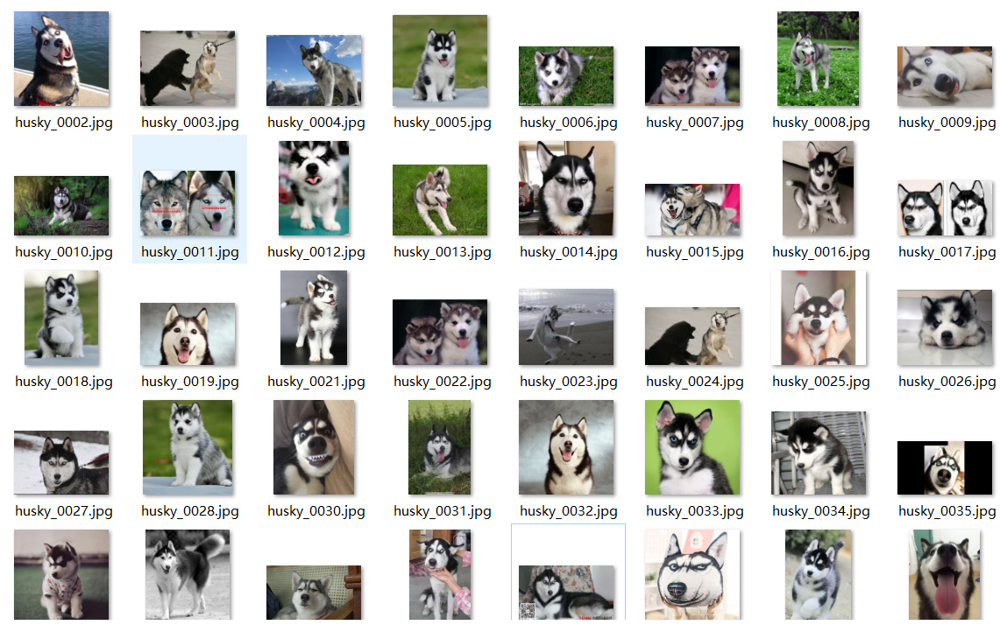

# imageSpider
an image spider of baidu based on python selenium version Chrome

## Direction 
before use, make sure you get everything in need 
### 1. python 3.x (not sure if 2.x works) 	 
with modules installed by pip: 		 
> $ pip install selenium 	 
> $ pip install argparse 	 
### 2. Chrome & chromedriver 
make sure your chromedriver's version get correct with your current Chrome Browser 
teleport for chromedriver: http://npm.taobao.org/mirrors/chromedriver/  
and the chromedriver.exe into where your Chrome and python locates: 
me for example: 
C:\Program Files (x86)\Google\Chrome\Application  
C:\Users\Shinelon\AppData\Local\Programs\Python\Python37  
### 3. run the code  
> $ python spider.py --key_word=husky --number=50 --dst_dir=./sample/husky --save_name=husky

here are the samples(already deleted the bad images):  

